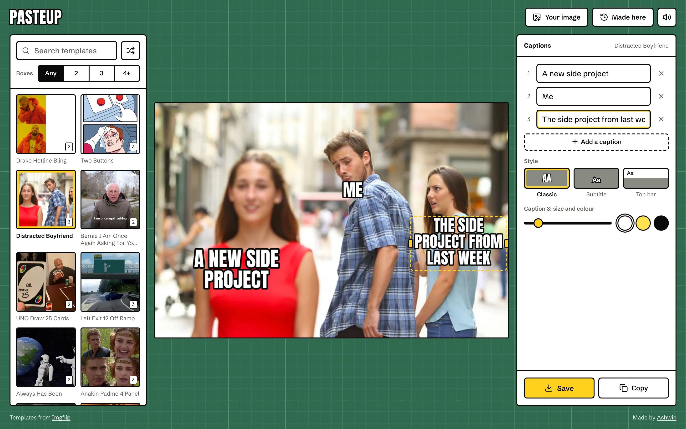
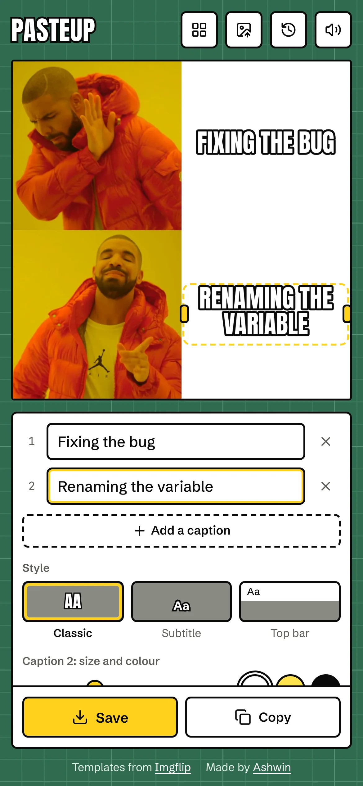
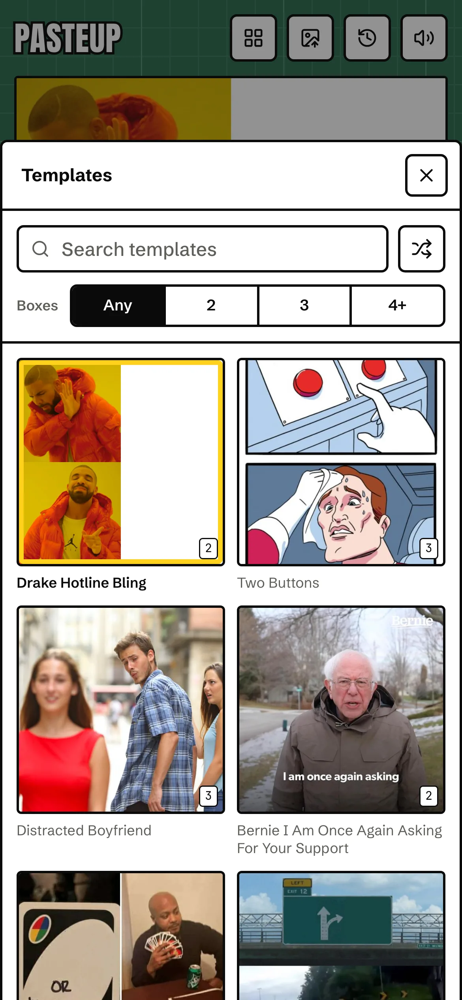
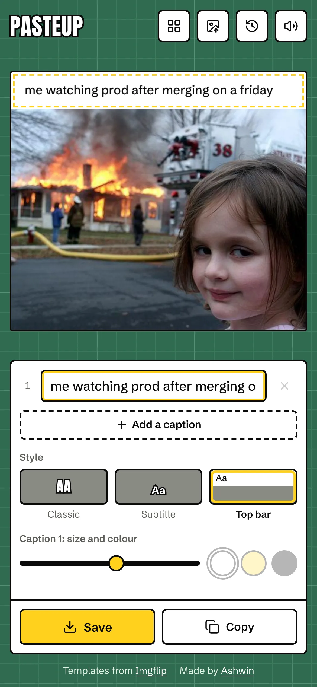
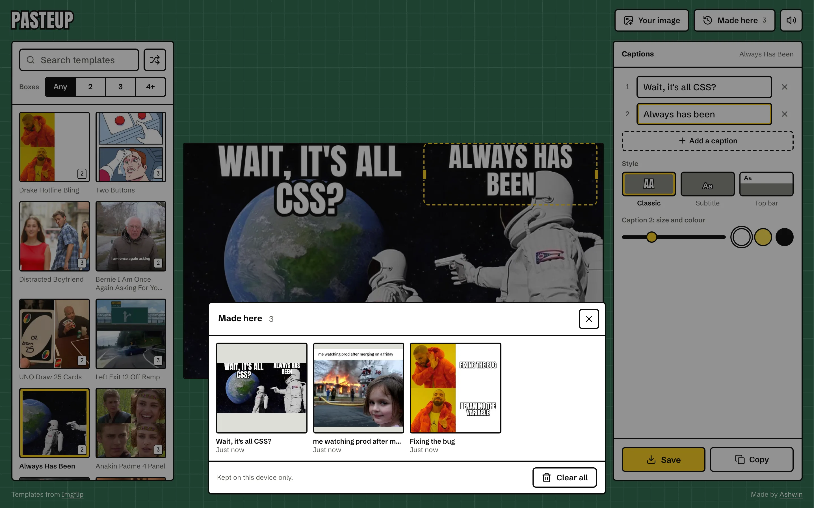
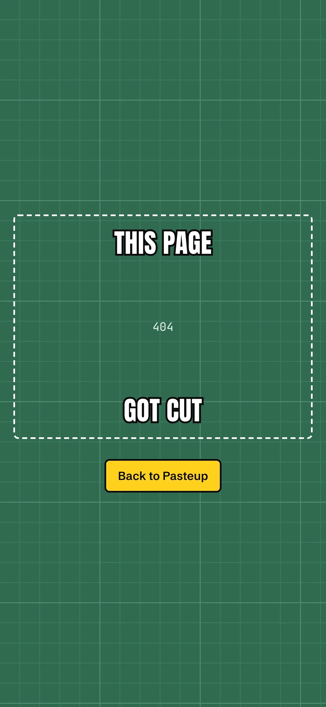

<p align="center">
  <a href="https://pasteup.ashwin.co.in">
    
  </a>
</p>

<p align="center">
  <a href="https://pasteup.ashwin.co.in"><strong>pasteup.ashwin.co.in</strong></a>
  &nbsp;·&nbsp;
  <a href="#what-it-does">what it does</a>
  &nbsp;·&nbsp;
  <a href="#drawn-in-the-browser">how it draws</a>
  &nbsp;·&nbsp;
  <a href="#running-it">running it</a>
</p>

<br>

the source of **[pasteup.ashwin.co.in](https://pasteup.ashwin.co.in)**, named after paste-up, the old way of making a page: cut the pieces out, lay them on a mat and stick them down. that is all a meme is. pick a template, write the joke, drag the words where they belong, and send it.

it used to be called meme generator and lived at memes.ashwin.co.in. this is a full rebuild: new name, new design, and a lot more to it.

## what it does

<p align="center">
  
  &nbsp;
  
  &nbsp;
  
</p>

- **imgflip's top 100.** search them by name, filter by how many caption boxes they have, or roll a random one.
- **captions where they go.** imgflip says how many boxes a template has but not where. for the 16 most used ones, the boxes start in the right spot: drake's on the right, the boyfriend's on each person, gru's on each board. everything else starts top and bottom, or spread down the image.
- **drag, resize, nudge.** drag a caption anywhere, pull its handles to change how wide it wraps, or focus it and use the arrow keys (`shift` for bigger steps). long lines shrink to fit instead of running off the image.
- **three styles.** classic white impact with a black outline, subtitle, and top bar, the white strip with plain text above the picture.
- **size and colour per caption.** white, yellow or black, each with the outline that reads on it.
- **your own image.** pick one, drop one on the mat, or paste one straight from the clipboard.
- **save, copy, share.** save downloads a full size jpg (png for png templates), copy puts it on the clipboard ready to paste into a chat, and share opens the share sheet on phones.
- **made here.** everything you save, copy or share is kept on your device, with its captions, so you can open it and change the joke later. your own images are kept too.
- **links to a template.** the address has the template in it, so `pasteup.ashwin.co.in/?t=181913649` opens drake.
- **it remembers.** close the tab halfway through a meme and it is still there when you come back.
- **switch templates, keep the joke.** captions you already wrote carry over when you try another template.
- **sounds.** a paper slide when you pick a template, a snip when you save, small ticks for taps. made with the web audio api, quiet under the ios silent switch, and mute in one tap.
- **a 404 that got cut out**, and every view sets its own page title.

## drawn in the browser

imgflip's own `caption_image` endpoint needs an account username and password, which would mean a server holding them. so pasteup asks imgflip for one thing, the template list:

```
GET https://api.imgflip.com/get_memes
```

and draws everything else itself.

- **one renderer.** [`src/lib/meme.js`](src/lib/meme.js) lays out and draws the meme on a canvas. the preview on the mat is that canvas, and so is the image you save, so what you see is exactly what you get.
- **sharp on small templates.** memes are drawn at least 900 px wide, so a tiny template still gets crisp text.
- **the handles are html.** the caption boxes you drag are real buttons laid over the canvas, positioned from the same layout the canvas uses, so they work with a keyboard and a screen reader.
- **fonts first.** the canvas waits for the fonts before drawing, so the first frame is never in a fallback face.
- **kept locally.** the draft sits in `localStorage`, and made here lives in indexeddb, because it holds images.

## the design

the page is a cutting mat, the green self-healing kind with a printed grid, because that is where paste-up happens.

- **the caption is the ui.** panels and buttons are white with a thick black outline, the same white fill and black stroke as a classic caption.
- **one yellow.** the yellow of a snap-off craft knife blade marks the selected caption, the selected template and save. nothing else is yellow.
- **type.** anton, the free cousin of impact, for the name and the captions. schibsted grotesk for everything else, and jetbrains mono for small numbers.
- **no dark mode.** the mat is already a mid green, and a meme looks the same either way, so there is no toggle.
- **one screen, every screen.** from a 320 px phone to a 2560 px monitor, portrait or landscape, it all fits without scrolling the page. phones stack the meme over the captions, landscape phones put them side by side, tablets add the templates as a sheet, and wide screens show all three columns.
- **nothing jumps.** fonts are self-hosted and preloaded with metric-matched fallbacks, the meme sits in a fixed box, and layout shift measures 0, even when a template link loads.
- **quiet motion.** sheets slide up and drag down to dismiss, captions fade in when added, buttons press in a little, and reduced motion turns it all off.

## the stack

| layer | choices |
| --- | --- |
| ui | [react 19](https://react.dev) and [vite 8](https://vite.dev) |
| style | [tailwind css 4](https://tailwindcss.com) |
| motion | [motion](https://motion.dev) for sheets, toasts and the caption list |
| drawing | the canvas 2d api |
| data | [imgflip](https://imgflip.com/api) for templates |
| type | [anton](https://fonts.google.com/specimen/Anton), [schibsted grotesk](https://fonts.google.com/specimen/Schibsted+Grotesk) and [jetbrains mono](https://www.jetbrains.com/lp/mono/), self-hosted |
| icons | [lucide](https://lucide.dev) |
| lint and format | [biome](https://biomejs.dev) |
| hosting | [vercel](https://vercel.com/) |

## running it

```sh
git clone https://github.com/Ashwin-S-Nambiar/Pasteup.git
cd Pasteup
npm install
npm run dev
```

then open http://localhost:5173. `npm run check` runs biome, and `npm run build` writes `dist/` with a matching `404.html`.

## the shape of it

```
src/
  App.jsx             layout, header, sheets, paste and template links
  components/
    Stage.jsx         the canvas and the draggable caption handles
    Captions.jsx      caption fields, style, size, colour, save, copy, share
    Templates.jsx     search, filter and the template grid
    Kept.jsx          made here
    Sheet.jsx         bottom sheet with drag to dismiss
    Toaster.jsx       toasts
    NotFound.jsx      the 404
  lib/
    meme.js           layout and drawing
    presets.js        caption spots for the most used templates
    editor.js         editor state, templates, images, export and made here
    actions.js        save, copy and share
    db.js             indexeddb
    sound.js          web audio
    store.js          tiny stores, toasts and haptics
public/fonts/         anton, schibsted grotesk and jetbrains mono
```

## known rough edges

- **caption spots are hand placed** for 16 templates. the other 84 start in a sensible default and need a drag.
- **copying an image** needs a browser that lets pages write images to the clipboard. save always works.
- **gifs** are drawn as a still of their first frame.

<details>
<summary><strong>more screenshots</strong></summary>

<br>



<p align="center">
  
</p>

</details>

## credit

meme templates come from [imgflip](https://imgflip.com/memetemplates).

---

[pasteup.ashwin.co.in](https://pasteup.ashwin.co.in) · [ashwin.co.in](https://ashwin.co.in) · [notes](https://notes.ashwin.co.in) · [x](https://x.com/ashwinnambiar11) · [github](https://github.com/Ashwin-S-Nambiar)
